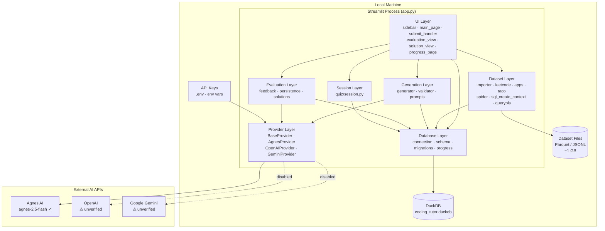
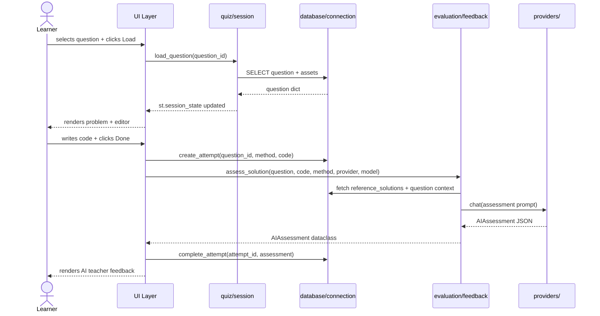
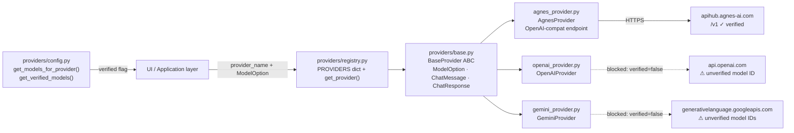
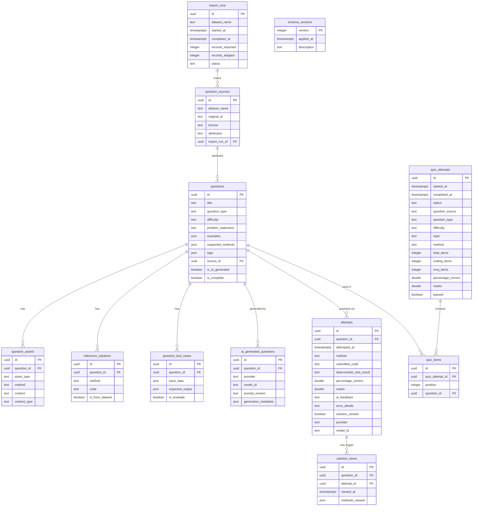

# Project Architecture Blueprint — Coding Tutor

> **Generated:** 2026-08-18  
> **Stack detected:** Python 3.11+ · Streamlit · DuckDB · OpenAI-compat SDK  
> **Pattern detected:** Layered Architecture with Clean Architecture traits  
> **Diagrams:** Mermaid (component, data-flow, sequence)

---

## Table of Contents

1. [Architectural Overview](#1-architectural-overview)
2. [Architecture Visualization](#2-architecture-visualization)
3. [Core Architectural Components](#3-core-architectural-components)
4. [Architectural Layers and Dependencies](#4-architectural-layers-and-dependencies)
5. [Data Architecture](#5-data-architecture)
6. [Cross-Cutting Concerns](#6-cross-cutting-concerns)
7. [Service Communication Patterns](#7-service-communication-patterns)
8. [Python/Streamlit Architectural Patterns](#8-pythonstreamlit-architectural-patterns)
9. [Implementation Patterns](#9-implementation-patterns)
10. [Testing Architecture](#10-testing-architecture)
11. [Deployment Architecture](#11-deployment-architecture)
12. [Extension and Evolution Patterns](#12-extension-and-evolution-patterns)
13. [Architectural Pattern Examples](#13-architectural-pattern-examples)
14. [Architectural Decision Records](#14-architectural-decision-records)
15. [Architecture Governance](#15-architecture-governance)
16. [Blueprint for New Development](#16-blueprint-for-new-development)

---

## 1. Architectural Overview

Coding Tutor is a **local-first, privacy-preserving** single-process Streamlit application. Its guiding principle is that all learner data stays on the local machine; only AI API calls cross a network boundary, and those are made with credentials the user supplies through environment variables.

### Guiding Principles

| Principle | How it manifests |
|---|---|
| **Local-first** | DuckDB embedded database, no cloud backend, datasets stored on disk |
| **No secrets in process** | API keys read once from env vars, never logged or stored; learner code is not executed |
| **Provider parity** | `BaseProvider` ABC forces identical interface across all AI backends |
| **Verified-only execution** | `ModelOption.verified` flag prevents calling model IDs not confirmed in official docs |
| **Idempotent state** | Schema migrations, dataset import, and generated question storage are all idempotent |
| **Fail-visible** | PySpark unavailability, unverified models, and incomplete questions surface explicit status messages; no silent substitutions |

### Architectural Pattern

The codebase follows a **layered architecture** in which dependency direction flows strictly from outer layers inward:

```
UI layer  →  Application layer  →  Domain layer  →  Infrastructure layer
```

This maps to the physical package structure under `src/coding_tutor/`:

```
ui/           ← outer: Streamlit rendering and event dispatch
quiz/         ← application: session state orchestration
generation/   ← application: AI question creation workflow
evaluation/   ← application: AI assessment, solution views, and persistence
dataset/      ← application: data import pipeline
providers/    ← domain: AI provider abstraction (pure Python, no Streamlit)
database/     ← infrastructure: DuckDB connection, DDL, migrations, queries
```

---

## 2. Architecture Visualization

### 2.1 High-Level Component Map



### 2.2 Question Lifecycle — Sequence Diagram



### 2.3 AI Provider Dispatch — Data Flow



---

## 3. Core Architectural Components

### 3.1 providers/ — AI Provider Abstraction

**Purpose:** Decouple all AI-calling code from any specific provider SDK. Every consumer (generator, feedback, solution view) calls the same `BaseProvider.chat()` interface.

**Key abstractions:**

| Class / object | Role |
|---|---|
| `BaseProvider` (ABC) | Contract: `is_configured()`, `get_model_options()`, `chat()` |
| `ModelOption` (dataclass) | Carries `verified: bool` — gate for API calls |
| `ChatMessage` (dataclass) | Role + content tuple passed into `chat()` |
| `ChatResponse` (dataclass) | Normalised response: content, model, provider |
| `PROVIDERS` dict | `{name: BaseProvider instance}` — registry in `registry.py` |

**Extension point:** Add a new provider by subclassing `BaseProvider`, implementing the three abstract methods, adding `ModelOption` entries with `verified=False` until officially confirmed, and registering in `PROVIDERS`.

### 3.2 database/ — Infrastructure Layer

**Purpose:** Own all persistence. No other module holds a DuckDB connection reference.

| Module | Role |
|---|---|
| `connection.py` | Module-level singleton `_connection`; `get_db()` creates on first call and runs migrations; `get_test_db()` returns a fresh in-memory connection |
| `schema.py` | Full DDL as `SCHEMA_SQL` constant — one `CREATE TABLE IF NOT EXISTS` per table |
| `migrations.py` | Version-tracked runner; applies `SCHEMA_SQL` once, records in `schema_versions` |
| `progress.py` | Read-only query functions: `get_all_attempts()`, `get_progress_summary()`, `get_question_attempts()` |

**Key pattern:** `get_db()` is the only app-level entry point. It is imported by every layer that needs persistence, making the database layer a classic infrastructure dependency that all higher layers reference downward.

### 3.3 evaluation/ — AI Assessment and Persistence

**Purpose:** Obtain a static AI estimate of correctness without executing learner code, then persist the result.

| Module | Role |
|---|---|
| `feedback.py` | `assess_solution()` builds a bounded context dict from the DB, sends a structured prompt via the provider layer, validates and parses `AIAssessment` from the JSON response |
| `persistence.py` | `create_attempt()`, `complete_attempt()`, `fail_attempt()`, `mark_solution_viewed()`, `record_solution_method()` — write-only functions for attempts and solution_views |
| `solutions.py` | Retrieves stored reference solutions and coordinates AI-generated teaching solutions |

**Design note:** Learner code is never executed. The AI model receives the question, method, submitted code, and bounded reference context. The returned `AIAssessment` carries an estimated correctness percentage, marks, identified mistakes, explanation, and suggested correction — all clearly labelled as AI estimates, not test results.

### 3.4 generation/ — AI Question Creation

**Purpose:** Generate, validate, and persist novel questions through the AI provider.

| Module | Role |
|---|---|
| `prompts.py` | Versioned string constants `ALGORITHM_SYSTEM_PROMPT`, `DATA_ANALYSIS_SYSTEM_PROMPT`, `PROMPT_VERSION` |
| `validator.py` | `validate_algorithm_question()`, `validate_data_analysis_question()` — raise `ValidationError` if the AI response is structurally incomplete |
| `generator.py` | Orchestrates: build prompt → call provider → parse JSON → validate → persist |

**Safety pattern:** Generation is rejected at multiple points — input validation (`question_type`, `difficulty`, `method`, `topic`) before the API call; `model.verified` and `provider.is_configured()` checks before calling the provider; and a `ValidationError` check before the database write. `generate_question()` returns a `GenerationResult` dataclass with `ok: bool`, `question_id`, `failure`, and `detail` fields — never raises to its caller.

### 3.5 dataset/ — Data Import Pipeline

**Purpose:** Import questions from Hugging Face research datasets into the local DuckDB database. Entirely offline after download.

Each dataset has a dedicated importer (`leetcode.py`, `apps_dataset.py`, `taco.py`, `spider.py`, `sql_create_context.py`, `querypls.py`, `codecontests.py`). `importer.py` is the orchestrator: it logs each run to `import_runs`, calls each importer, and records per-dataset results.

**Idempotency:** Import uses `question_sources` uniqueness on `(dataset_name, original_id)` to skip already-imported records.

### 3.6 quiz/ — Session State Management

**Purpose:** Manage Streamlit session state in one place, hiding `st.session_state` access from the UI rendering functions.

`session.py` provides: `get_current_question()`, `load_question(id)`, `clear_question_with_confirm()`. These functions read/write the session state dict and call `get_db()` for question data.

### 3.7 ui/ — Streamlit Rendering

**Purpose:** Render all UI components and dispatch user events to the application layer. Contains no business logic.

| Module | Responsibility |
|---|---|
| `sidebar.py` | Provider/model selector, question type, difficulty, method, question source radio |
| `main_page.py` | Question picker (dataset/AI/mixed), problem display, code editor |
| `submit_handler.py` | `Done` button handler: orchestrates AI assessment → persistence → UI update |
| `evaluation_view.py` | Test result display + AI teacher feedback panel |
| `solution_view.py` | Reference and AI-generated solutions by method |
| `progress_page.py` | Attempt history table with filtering |

---

## 4. Architectural Layers and Dependencies

```mermaid
graph BT
    subgraph Infrastructure
        DB["database/\nDuckDB · schema · migrations · progress"]
    end
    subgraph Domain
        PROV["providers/\nBaseProvider ABC · ModelOption · ChatMessage"]
    end
    subgraph Application
        EVAL["evaluation/\nfeedback · persistence · solutions"]
        GEN["generation/\ngenerator · validator · prompts"]
        DS["dataset/\nimporter · per-dataset loaders"]
        QUIZ["quiz/\nsession state helpers"]
    end
    subgraph UI
        UI["ui/\nStreamlit rendering modules"]
        APP["app.py\nentry point · page routing"]
    end

    DB --> PROV
    DB --> EVAL
    DB --> GEN
    DB --> DS
    DB --> QUIZ
    PROV --> EVAL
    PROV --> GEN
    EVAL --> UI
    GEN --> UI
    DS --> UI
    QUIZ --> UI
    UI --> APP
```

**Dependency rules:**
- `ui/` and `app.py` may import from any layer below
- `quiz/`, `generation/`, `evaluation/`, `dataset/` may import `providers/` and `database/` but **not** `ui/`
- `providers/` may import `database/` but **not** application or UI layers
- `database/` imports nothing from this project — pure infrastructure

**No circular dependencies** were found in the knowledge graph analysis.

---

## 5. Data Architecture

### 5.1 Schema Overview (10 tables)



### 5.2 Key Data Patterns

| Pattern | Implementation |
|---|---|
| **Immutable attempt history** | `attempts` table — every submission is a new row; previous attempts are never overwritten |
| **Source provenance** | `question_sources` uniqueness on `(dataset_name, original_id)` enables idempotent import |
| **Completeness flag** | `questions.is_complete` distinguishes fully executable questions from schema-only imports |
| **Method-scoped assets** | `question_assets.method` column scopes starter code and expected results to a coding method |
| **Audit log** | `import_runs` and `schema_versions` give a full history of how the DB reached its current state |
| **AI provenance** | `ai_generated_questions` records provider, model ID, and prompt version for every AI-created question |

---

## 6. Cross-Cutting Concerns

### 6.1 Security Model

**API key protection:**  
Keys are read once from environment variables at provider construction time (`os.environ.get(...)`). They are never logged, stored in the database, printed to the console, or committed to version control. `.env` is in `.gitignore`.

**No code execution:**  
Learner code is not executed by the application. When assessment is requested, the question, method, submitted editor text, and bounded reference context are sent to the selected AI provider. The provider returns an estimate of correctness — the app never runs the learner's code as a program. This is documented prominently in the README and `DISCLAIMER.md`.

**Data responsibility:**  
Users are responsible for the content they submit to external AI APIs. The application does not filter, redact, or screen submitted code before sending it to the provider.

### 6.2 Error Handling

| Layer | Strategy |
|---|---|
| Provider calls | `generate_question()` returns `GenerationResult(failure=…)` — never raises; `assess_solution()` raises typed `AssessmentError` |
| JSON parsing | Explicit try/except with typed errors (`AssessmentError`, `ValidationError`) |
| DB operations | `conn.execute("BEGIN TRANSACTION")` + `conn.rollback()` on exception in `_save_generated_question()`; `conn.commit()` only on success |
| UI | `st.warning()` / `st.error()` surface failures; no silent fallback |

### 6.3 Validation Strategy

Two distinct validation tiers:

**Structural validation (generation):** `validator.py` checks AI-generated question JSON for required keys and field types before any database write. Incomplete responses are rejected with `ValidationError`.

**Schema-level validation (database):** DuckDB `CHECK` constraints enforce `question_type IN ('algorithm','data_analysis')`, `difficulty IN ('Beginner','Easy','Medium','Hard','Very Hard')`, and `test_result IN ('passed','failed','error','timeout','pending')`.

**Input validation (provider calls):** `model.verified` is checked before every provider call. `provider.is_configured()` is checked before every AI request.

### 6.4 Configuration Management

| Config source | What it controls |
|---|---|
| `.env` file | `AGNES_API_KEY`, `OPENAI_API_KEY`, `GOOGLE_API_KEY`, `OPENAI_BASE_URL`, `CODING_TUTOR_DB` |
| `.streamlit/config.toml` | Server host (`127.0.0.1`), port (`8551`) |
| `pyproject.toml` | Package metadata, dependency pins |
| `providers/config.py` | Model registry with `verified` flags |
| `generation/prompts.py` | Prompt templates and `PROMPT_VERSION` constant |

No feature flags, no runtime config mutation.

---

## 7. Service Communication Patterns

This is a **single-process application**. There are no microservices, no message queues, and no inter-process communication except:

1. **AI provider HTTP calls** — synchronous HTTPS via OpenAI SDK or Google Generative AI SDK
2. **DuckDB file I/O** — via embedded driver, no network

### Provider Call Pattern (synchronous)

```
UI layer
  → application layer (generator.py / feedback.py)
    → providers/registry.get_provider(name)
      → BaseProvider.chat(messages, model, system_prompt)
        → provider-specific SDK
          → external HTTPS endpoint
            → ChatResponse
```

All calls are blocking. Streamlit's `st.spinner()` wraps long-running calls to give visual feedback.

---

## 8. Python/Streamlit Architectural Patterns

### 8.1 Streamlit Session State as Application State

Streamlit re-runs the entire script on every user interaction. State is preserved in `st.session_state`, a dictionary-like object. The `quiz/session.py` module centralises all session state reads and writes:

```python
# Reading
question = st.session_state.get("current_question")

# Writing
st.session_state.current_question = question_dict
st.session_state.question_id = question_id

# Triggering a re-render
st.rerun()
```

UI widgets with `key=` parameters write directly to `st.session_state` (e.g., `key="question_type"` writes the dropdown value).

### 8.2 Trigger Pattern for Multi-Step Operations

Multi-step operations that span a Streamlit re-run use a boolean trigger in session state:

```python
# Button sets trigger
if st.button("✅ Done"):
    st.session_state.submit_trigger = True
    st.rerun()

# Next render checks trigger
if st.session_state.get("submit_trigger"):
    handle_submit(question, method)
```

This avoids re-running expensive operations on every interaction.

### 8.3 Singleton Database Connection

DuckDB maintains one connection per process. The module-level `_connection` in `connection.py` acts as an application-scoped singleton:

```python
_connection: duckdb.DuckDBPyConnection | None = None

def get_db() -> duckdb.DuckDBPyConnection:
    global _connection
    if _connection is None:
        _connection = duckdb.connect(_DB_PATH)
        run_migrations(_connection)
    return _connection
```

Tests use `get_test_db()` which always returns a fresh `:memory:` connection, preventing test pollution.

### 8.4 uv Package Management

Dependencies are declared in `pyproject.toml` and locked in `uv.lock`. All commands use `uv run`:

```bash
uv run streamlit run app.py    # start app
uv run pytest                  # run tests
uv run python scripts/download_datasets.py  # dataset download
```

The virtual environment is at `.venv/` and is never committed.

---

## 9. Implementation Patterns

### 9.1 Provider Implementation Template

```python
import os
from coding_tutor.providers.base import BaseProvider, ModelOption, ChatMessage, ChatResponse

class MyProvider(BaseProvider):
    BASE_URL = "https://api.example.com/v1"

    def is_configured(self) -> bool:
        return bool(os.environ.get("MY_API_KEY"))  # check existence only

    def get_model_options(self) -> list[ModelOption]:
        return [
            ModelOption(
                provider="my_provider",
                model_id="my-model-v1",       # exact ID from official docs
                display_name="My Model v1",
                verified=True,                # set False until doc-confirmed
            )
        ]

    def chat(self, messages, model, system_prompt=None):
        # ... call SDK, map response ...
        return ChatResponse(content=..., model=model.model_id, provider="my_provider")
```

Register in `providers/registry.py`:
```python
PROVIDERS["my_provider"] = MyProvider()
PROVIDER_DISPLAY_NAMES["my_provider"] = "My Provider"
```

### 9.2 Dataset Importer Template

Each importer follows the same pattern:

```python
def import_my_dataset(conn, dataset_dir: Path) -> tuple[int, int]:
    """Returns (imported, skipped)."""
    imported = skipped = 0
    for record in _load_records(dataset_dir):
        # Check idempotency
        exists = conn.execute(
            "SELECT 1 FROM question_sources WHERE dataset_name = ? AND original_id = ?",
            ["my_dataset", record["id"]],
        ).fetchone()
        if exists:
            skipped += 1
            continue
        # Write source + question + assets in one transaction
        _write_question(conn, record)
        imported += 1
    return imported, skipped
```

### 9.3 UI Module Pattern

Each UI module exposes one public `render_*` function and keeps helpers private:

```python
def render_my_page():          # called from app.py
    _load_data()
    _render_section_a()
    _render_section_b()

def _load_data():              # private helpers
    ...
```

---

## 10. Testing Architecture

### 10.1 Test Strategy

All tests run without API keys or downloaded datasets. Provider calls are mocked; database tests use `get_test_db()` (in-memory DuckDB with the full schema).

```
tests/
├── fixtures/           ← minimal sample files for import pipeline tests
├── test_config.py      ← ModelOption, verified flag, provider registry
├── test_providers.py   ← BaseProvider interface, mock chat responses
├── test_database.py    ← schema creation, migration idempotency
├── test_import.py      ← dataset importer logic with fixture files
├── test_generation.py  ← generate_question flow, GenerationResult, validator
├── test_evaluation.py  ← feedback parsing, attempt persistence, sanitization
└── test_ui.py          ← session state helpers, sidebar state
```

### 10.2 Test Patterns

**In-memory database:**
```python
@pytest.fixture
def db(clear_provider_env):
    conn = get_test_db()
    yield conn
    conn.close()
```

**Provider mocking:**
```python
def test_generate_question(mocker, db):
    mock_provider = mocker.Mock(spec=BaseProvider)
    mock_provider.is_configured.return_value = True
    mock_provider.chat.return_value = ChatResponse(content=VALID_JSON, ...)
    mocker.patch("coding_tutor.providers.registry.get_provider", return_value=mock_provider)
```

**Environment cleanup fixture:**
```python
@pytest.fixture(autouse=True)
def clear_provider_env():
    for key in ["AGNES_API_KEY", "OPENAI_API_KEY", "GOOGLE_API_KEY"]:
        os.environ.pop(key, None)
    yield
```

### 10.3 Test Boundaries

| Layer | Test type | Isolation mechanism |
|---|---|---|
| Database schema | Integration | `:memory:` DuckDB |
| Import pipeline | Integration | `:memory:` DuckDB + fixture files |
| Generator/feedback | Unit | mock provider + `:memory:` DuckDB |
| Provider | Unit | mock HTTP responses |
| Session/UI helpers | Unit | `st.session_state` cleared per test |

---

## 11. Deployment Architecture

### 11.1 Runtime Topology

```
User's machine
└── Python 3.11+ process (uv-managed venv)
    └── Streamlit server (127.0.0.1:8551)
        └── app.py
            └── DuckDB file I/O (coding_tutor.duckdb)
```

No containers, no cloud backend, no reverse proxy. The app is intentionally single-user and local.

### 11.2 Launch Paths

| Path | Command |
|---|---|
| Windows double-click | `launch_app.cmd` — checks uv, syncs deps, starts app |
| CLI | `uv run streamlit run app.py` |
| Custom DB path | `CODING_TUTOR_DB=/path/to/db.duckdb uv run streamlit run app.py` |

### 11.3 First-Run Initialisation

On first `get_db()` call:
1. Create the DuckDB file at `_DB_PATH`
2. Apply `SCHEMA_SQL` (all tables `CREATE IF NOT EXISTS`)
3. Record schema version in `schema_versions`

Dataset import is a separate step (`run_import(get_db())`). The app runs without datasets — the question picker shows an informational message.

---

## 12. Extension and Evolution Patterns

### 12.1 Adding a New AI Provider

1. Create `src/coding_tutor/providers/my_provider.py` implementing `BaseProvider`
2. Set `verified=False` on all `ModelOption` entries until model IDs are confirmed in official documentation
3. Add to `PROVIDERS` dict and `PROVIDER_DISPLAY_NAMES` in `registry.py`
4. Add `get_models_for_provider("my_provider")` entry to `config.py`
5. Add `MY_API_KEY` to `.env.example` (empty value only)
6. Add tests in `test_providers.py` with a mock

No changes required to generation, feedback, or UI layers.

### 12.2 Adding a New Dataset

1. Create `src/coding_tutor/dataset/my_dataset.py` with `import_my_dataset(conn, path) -> tuple[int, int]`
2. Register in `dataset/importer.py`'s `IMPORTERS` dict
3. Add a downloader entry in `scripts/download_datasets.py`'s `DATASETS` list
4. Document in `docs/dataset-setup.md` and update `README.md`'s dataset table

### 12.3 Adding a New Question Method

The method system is data-driven. Methods are stored in `questions.supported_methods` (JSON array) and `question_assets.method` (column). To add a new method (e.g., `"dask"`):

1. Add a starter code template in `main_page.py`'s `_get_starter_code()` templates dict
2. Add to `DATA_ANALYSIS_METHODS` in `sidebar.py`
3. Update generation prompts in `generation/prompts.py` to include the method
4. Update `QUESTION_METHODS` in `generation/generator.py` to map the new method

### 12.4 Adding a New UI Page

1. Create `src/coding_tutor/ui/my_page.py` with `render_my_page()`
2. Add a `st.Page` entry in `app.py`'s navigation setup
3. Call `get_db()` directly for any data needs — do not pass the connection as a parameter

### 12.5 Schema Migrations

The migration runner in `migrations.py` is version-tracked. To add a migration:

```python
MIGRATIONS = [
    (1, "initial schema", _apply_v1),
    (2, "add my_column to questions", _apply_v2),  # new entry
]

def _apply_v2(conn):
    conn.execute("ALTER TABLE questions ADD COLUMN my_column TEXT")
```

The runner applies each migration in order, skipping already-applied versions recorded in `schema_versions`.

---

## 13. Architectural Pattern Examples

### 13.1 Provider Abstraction — Layer Separation

The abstract base class ensures no consumer ever couples to a specific SDK:

```python
# base.py — domain contract
class BaseProvider(ABC):
    @abstractmethod
    def chat(self, messages: list[ChatMessage], model: ModelOption,
             system_prompt: Optional[str] = None) -> ChatResponse: ...

# agnes_provider.py — infrastructure implementation
class AgnesProvider(BaseProvider):
    def chat(self, messages, model, system_prompt=None):
        client = openai.OpenAI(
            api_key=os.environ["AGNES_API_KEY"],
            base_url="https://apihub.agnes-ai.com/v1",
        )
        # ... map ChatMessage → openai format, call API, map back
        return ChatResponse(content=..., model=model.model_id, provider="agnes")

# feedback.py — application layer, provider-agnostic
provider = get_provider(provider_name)   # returns any BaseProvider
response = provider.chat(messages, model, system_prompt=...)
```

### 13.2 Verified-Only Guard Pattern

```python
# In every application layer function that calls a provider:
if not model.verified:
    raise AssessmentError("Select a verified model before submitting.")

if not provider.is_configured():
    raise AssessmentError(f"{provider_name.title()} credentials are not configured.")
```

This two-check pattern appears in `generate_question()`, `assess_solution()`, and the UI rendering functions before showing action buttons.

### 13.3 Idempotent Import Pattern

```python
exists = conn.execute(
    "SELECT 1 FROM question_sources WHERE dataset_name = ? AND original_id = ?",
    [dataset_name, record_original_id],
).fetchone()
if exists:
    skipped += 1
    continue
# ... write new record
imported += 1
```

### 13.4 Structured AI Response Parsing

```python
def _parse_assessment(content: str, model_id: str, provider_name: str) -> AIAssessment:
    raw = content.strip()
    if raw.startswith("```json") and raw.endswith("```"):
        raw = raw[7:-3].strip()
    data = json.loads(raw)   # raises JSONDecodeError → AssessmentError
    required = {"estimated_percentage_correct", "identified_mistakes", ...}
    if set(data) != required:
        raise AssessmentError("The model returned an invalid assessment schema.")
    # ... field-by-field type checks ...
    return AIAssessment(...)
```

---

## 14. Architectural Decision Records

### ADR-001: Streamlit as the UI framework

**Context:** The project is a local learning tool requiring rapid iteration and an interactive code editor with minimal frontend complexity.

**Decision:** Streamlit — its session state model maps naturally to a quiz/practice flow, and it ships a built-in code input widget.

**Consequences:**
- ✅ Zero JavaScript, no build step, fast to iterate
- ✅ Built-in session state handles multi-step flows
- ⚠ Single-user process model — not suitable for shared deployment
- ⚠ Every user interaction re-runs the script — requires the trigger pattern for multi-step operations

### ADR-002: DuckDB as the embedded database

**Context:** All data must stay local. A file-based, zero-server database was required.

**Decision:** DuckDB — analytical-optimised, supports full SQL including JSON functions, and has a Python-native driver.

**Consequences:**
- ✅ No database server to manage
- ✅ Rich SQL support including `gen_random_uuid()`, `TIMESTAMPTZ`, JSON columns
- ✅ In-memory mode (`:memory:`) enables clean test isolation
- ⚠ Single-writer model — consistent with single-user scope

### ADR-003: BaseProvider ABC for all AI calls

**Context:** The app targets multiple AI providers. Provider-specific code spread across the codebase would make adding or swapping providers expensive.

**Decision:** `BaseProvider` ABC with `ModelOption`, `ChatMessage`, `ChatResponse` as the domain types. All application-layer code calls only the abstract interface.

**Consequences:**
- ✅ Adding a new provider requires changes in one file only (`registry.py`) plus the new provider module
- ✅ Mocking in tests is trivial — mock the abstract class
- ✅ The `verified` flag gate lives in one place (`base.py`)

### ADR-004: AI-only assessment — no code execution

**Context:** Correctness feedback is essential for learning. Running arbitrary learner code securely (isolation, sandboxing, resource limits) is a significant engineering and security challenge outside the scope of a local learning tool.

**Decision:** Learner code is never executed. When the learner clicks Done, the question, method, and submitted editor text are sent to the selected AI provider in a structured prompt. The provider returns a structured `AIAssessment` JSON with estimated correctness, marks, identified mistakes, explanation, and suggested correction. All outputs are clearly labelled as AI estimates.

**Consequences:**
- ✅ No code execution risk — no subprocess, no sandboxing complexity
- ✅ Works for all methods (Python, SQL, Pandas, PySpark, Polars) without method-specific runtimes
- ✅ Simplified security model — API key hygiene is the only security boundary
- ⚠ Correctness percentages are AI estimates, not deterministic test results — documented clearly in README and DISCLAIMER
- ⚠ AI provider call required for assessment — no offline fallback

### ADR-005: `verified` flag on ModelOption

**Context:** Provider documentation for exact model IDs changes frequently; deploying with an incorrect model ID causes silent failures or unexpected behaviour.

**Decision:** Each `ModelOption` carries a `verified: bool`. Only models confirmed in official documentation at implementation time have `verified=True`. Unverified models are visible in the sidebar but blocked from API calls, with a clear reason shown.

**Consequences:**
- ✅ Users see which models are available vs. blocked and why
- ✅ New model IDs are disabled by default until verified
- ⚠ Models must be re-verified and the flag updated when provider documentation changes

### ADR-006: Mixed question source mode

**Context:** Learners benefit from both curated dataset questions (known solutions, repeatable) and freshly generated questions (variety, custom difficulty).

**Decision:** Three-option `st.segmented_control` in the sidebar: Dataset / AI Generated / Mixed. A `topic` text input appears for AI-generated and mixed modes. Mixed mode picks AI or dataset with equal probability (50/50) via the testable `_choose_mixed_source(has_dataset, has_ai)` helper, falling back gracefully when one source is unavailable. Dataset queries are method-aware (`json_contains(supported_methods, to_json(method))`). Question display shows source attribution (dataset name + license, or AI provider/model ID).

**Consequences:**
- ✅ Flexible learning experience without forcing an either/or choice
- ✅ Graceful degradation — Mixed works with only datasets or only AI
- ✅ Topic input allows learners to steer AI-generated question subject matter
- ✅ `_choose_mixed_source()` is a pure helper, testable without Streamlit
- ⚠ 50/50 split is hardcoded; a future preference setting could make it configurable

---

## 15. Architecture Governance

### Consistency Checks

| Check | Mechanism |
|---|---|
| Dependency constraints | `uv.lock` pins exact versions; `uv sync --frozen` enforces them |
| Test isolation | `clear_provider_env` fixture removes all API keys before every test |
| Schema idempotency | `CREATE TABLE IF NOT EXISTS` + version-tracked migrations |
| Secret hygiene | `.gitignore` excludes `.env`, `.venv`, `Dataset/`, `*.duckdb` |
| Model verification | `ModelOption.verified` flag — code review check before setting `True` |

### Review Checklist for Architectural Changes

- [ ] Does the change respect the dependency direction (UI → App → Domain → Infra)?
- [ ] Are all `ModelOption` entries that change `verified=True` backed by a citation in the commit message?
- [ ] Does any new provider call use `is_configured()` and `model.verified` checks?
- [ ] Does any new dataset importer implement idempotency via `question_sources` uniqueness?
- [ ] Does any new schema change go through a versioned migration entry?
- [ ] Do tests avoid real API calls and real DB files?

---

## 16. Blueprint for New Development

### Starting Points by Feature Type

| Feature type | Starting file | Pattern to follow |
|---|---|---|
| New AI provider | `providers/my_provider.py` | Copy `agnes_provider.py`, implement 3 abstract methods |
| New dataset | `dataset/my_dataset.py` | Copy `leetcode.py`, implement idempotent importer |
| New question method | `ui/main_page.py` + `ui/sidebar.py` | Add starter template + method constant |
| New UI page | `ui/my_page.py` + `app.py` | Expose `render_my_page()`, register in nav |
| New DB table | `database/schema.py` + `database/migrations.py` | Add DDL constant, add migration entry |
| New prompt template | `generation/prompts.py` | Add constant, increment `PROMPT_VERSION` |
| New progress query | `database/progress.py` | Add typed function returning dicts or DataFrame |

### Development Workflow

1. **Write the test first** — use `get_test_db()` for DB tests, `mocker.Mock(spec=BaseProvider)` for provider tests
2. **Add to the innermost layer** — implement providers and database modules before wiring them to application or UI layers
3. **Gate AI calls** — always check `model.verified` and `provider.is_configured()` before calling `provider.chat()`
4. **Return `GenerationResult` on generation failure** — `generate_question()` returns `GenerationResult(failure=…)` and never raises; callers check `.ok` or `.failure` to decide what to show
5. **Commit idempotently** — every write to `questions` should check for existence first via `question_sources`

### Common Pitfalls to Avoid

| Pitfall | Correct approach |
|---|---|
| Passing `conn` as a function parameter | Call `get_db()` directly inside the function |
| Calling a provider without `verified` check | Always guard with `if not model.verified: raise/return` |
| Writing session state in non-UI modules | Keep `st.session_state` access inside `ui/` and `quiz/session.py` |
| Claiming code was executed or tested | AI assessment estimates correctness — never state that code was run or tests passed |
| Setting `verified=True` without a doc citation | Include the official documentation URL in the commit message |
| Committing `.env`, `*.duckdb`, or `Dataset/` | These are in `.gitignore` — verify with `git status` before staging |

---

*This blueprint was last updated on 2026-08-19 to reflect the removal of subprocess code execution (`runner.py` deleted), addition of Quiz Mode (`quiz_attempts`, `quiz_items` tables), and the `GenerationResult` return type from `generate_question()`. Re-run `/architecture-blueprint-generator` after significant architectural changes to keep this document current.*
