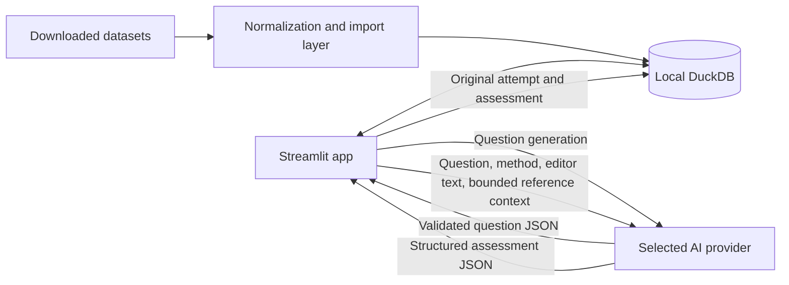

<div align="center">

# Coding Tutor

**A local Streamlit app for practicing coding problems with static, teacher-style AI feedback.**

[](https://www.python.org/)
[](https://streamlit.io/)
[](https://duckdb.org/)
[](LICENSE)

**[github.com/pypi-ahmad/Coding-Tutor](https://github.com/pypi-ahmad/Coding-Tutor)**

[Features](#features) · [Get started](#installation-and-setup) · [Usage](#usage) · [Architecture](#how-it-works) · [Community](#community)

</div>

Coding Tutor combines a local question bank, on-demand AI question generation, an in-browser editor, and progress tracking in one application. It supports algorithm practice in Python and data-analysis practice with SQL, Pandas, PySpark, or Polars.

## Table of Contents

- [Features](#features)
- [Tech Stack](#tech-stack)
- [Project Structure](#project-structure)
- [Installation and Setup](#installation-and-setup)
- [Environment Variables](#environment-variables)
- [Usage](#usage)
  - [Supported Modes](#supported-modes)
  - [Quiz Mode](#quiz-mode)
  - [Download and Import Datasets](#download-and-import-datasets)
- [How It Works](#how-it-works)
- [Configuration Options](#configuration-options)
- [Testing](#testing)
- [Documentation Index](#documentation-index)
- [Data Responsibility and Limitations](#data-responsibility-and-limitations)
- [Community](#community)
- [License](#license)
- [Acknowledgements](#acknowledgements)

> [!IMPORTANT]
> Coding Tutor does **not** execute learner-submitted code. Correctness percentages, marks, mistakes, and suggested corrections are estimates produced by the selected AI model, not actual test results.

> [!WARNING]
> You are 100% responsible for every question, code sample, dataset, credential, and other piece of data you process or transmit with this application. AI features send relevant content to the provider you select and are subject to that provider's terms and privacy policy.

## Features

- **Three question sources** — choose a repeatable curated dataset question, generate a fresh AI question, or use Mixed mode for a 50/50 choice when both sources are available.
- **Multiple practice methods** — Python for algorithms; SQL, Pandas, PySpark, and Polars for data analysis.
- **Configurable learning experience** — select question type, difficulty, method, topic, AI provider, and model.
- **Static AI assessment** — receive AI-estimated correctness and marks, identified mistakes, explanations, and suggested corrections without running learner code.
- **Correction workflow** — preview a model-proposed correction, explicitly apply it, and restore the pre-correction editor text while the original attempt remains stored unchanged.
- **Teacher-style solutions** — view every stored reference with its source label, or explicitly request a validated, well-commented AI teaching solution for one method at a time.
- **Complete local progress tracking** — preserve every submission as a separate DuckDB attempt, including failed AI requests, per-attempt marks, solved status, and solution-view history.
- **Resumable Quiz Mode** — build a 1–10 question coding/MCQ quiz from randomly selected questions, save drafts locally, retry failed AI assessments, and track quiz results separately from practice.
- **Dataset provenance** — retain and display source attribution and licensing metadata from normalized dataset imports.
- **Provider choice** — use OpenAI, Agnes AI, or Google Gemini with credentials from your own system environment.

## Screenshot

> [!NOTE]
> A screenshot or short demo GIF has not been added yet. Contributions that document the current interface are welcome.

## Tech Stack

| Area | Technology |
| --- | --- |
| Application UI | Streamlit |
| Language | Python 3.11+ |
| Local storage | DuckDB |
| Data handling | pandas and PyArrow |
| AI SDKs | OpenAI Python SDK and Google Gen AI SDK |
| Dataset downloads | Hugging Face Hub |
| Dependency management | uv |
| Packaging | Hatchling |
| Testing | pytest and pytest-mock |

## Project Structure

```text
Coding-Tutor/
├── app.py                         # Streamlit entry point and session initialization
├── launch_app.cmd                 # Windows launcher
├── pyproject.toml                 # Package metadata and dependencies
├── uv.lock                        # Reproducible dependency lock
├── .streamlit/config.toml         # Local host and port configuration
├── .env.example                   # Environment-variable names only; not loaded
├── scripts/
│   └── download_datasets.py       # Optional Hugging Face dataset downloader
├── docs/
│   └── dataset-setup.md           # Dataset download and import guide
├── src/coding_tutor/
│   ├── database/                  # DuckDB connection, schema, migrations, progress
│   ├── dataset/                   # Dataset-specific normalization and importers
│   ├── evaluation/                # Structured AI assessment and persistence
│   ├── generation/                # AI question prompts, validation, and storage
│   ├── providers/                 # OpenAI, Agnes AI, and Gemini adapters
│   ├── quiz/                      # Current-question session state
│   └── ui/                        # Practice, assessment, solution, and progress views
├── tests/                         # Unit, integration, and Streamlit AppTest coverage
└── .github/                       # Issue and pull-request templates
```

Raw datasets live under the gitignored root-level `Dataset/` directory and are never renamed or modified by the normalization layer.

```text
Dataset/
├── algorithm_problems/
│   ├── LeetCodeDataset/
│   ├── apps/
│   ├── TACO/
│   └── CodeContests/
└── data_analysis_problems/
    ├── spider/
    ├── sql-create-context/
    └── querypls-prompt2sql-dataset/
```

The downloader preserves each source repository's internal subdirectories. See the [dataset setup guide](docs/dataset-setup.md) for the expected files within each directory.

## Installation and Setup

Windows 11 is the tested platform. Linux and macOS users can use the command-line workflow on a community best-effort basis.

### Prerequisites

- [Git](https://git-scm.com/)
- Python 3.11 or later
- [uv](https://docs.astral.sh/uv/)
- An API key for at least one supported provider to generate questions or assess solutions

### 1. Clone the repository

```bash
git clone https://github.com/pypi-ahmad/Coding-Tutor.git
cd Coding-Tutor
```

### 2. Install dependencies

```bash
uv sync
```

### 3. Configure a provider

Set at least one provider key in your **system environment**. The application intentionally does not load `.env` files.

For a temporary PowerShell session, set one of the following with your own value:

```powershell
$env:OPENAI_API_KEY = "<your-key>"
# or
$env:AGNES_API_KEY = "<your-key>"
# or
$env:GOOGLE_API_KEY = "<your-key>"
```

Open a new terminal or restart the app after changing persistent Windows environment variables. Do not commit credentials, paste them into issues, or place real values in `.env.example`.

### 4. Start the app

From a terminal:

```bash
uv run streamlit run app.py
```

Then open <http://127.0.0.1:8551>.

On Windows, you can instead double-click `launch_app.cmd`. The launcher verifies `uv`, installs the locked dependencies, and starts Streamlit at the same address.

## Environment Variables

| Variable | Required | Purpose |
| --- | --- | --- |
| `OPENAI_API_KEY` | For OpenAI | Authenticates OpenAI requests. |
| `OPENAI_BASE_URL` | No | Optional OpenAI endpoint override; blank uses the official default. |
| `AGNES_API_KEY` | For Agnes AI | Authenticates Agnes AI requests. |
| `GOOGLE_API_KEY` | For Gemini | Authenticates Google Gemini requests. |
| `CODING_TUTOR_DB` | No | Overrides the default `coding_tutor.duckdb` database path. |
| `HF_TOKEN` | No | Authenticates optional Hugging Face dataset downloads. |
| `HUGGING_FACE_HUB_TOKEN` | No | Fallback name for the Hugging Face token. |

Only the selected AI provider receives API requests. Credential values are not written to DuckDB by the application.

### Local storage and privacy

By default, questions, attempts, quiz history, solution-view events, and progress are stored in `coding_tutor.duckdb` in the project directory. Set `CODING_TUTOR_DB` to use another local path. DuckDB is embedded, so no database server or cloud account is required.

The database remains on the user's machine. Content leaves the machine only when the user explicitly requests AI generation, assessment, or an AI-authored solution; the relevant question, editor text, and bounded reference context are then sent to the selected provider. API keys are read from the process environment and are not stored in DuckDB or displayed by the app. Backing up, securing, and deleting the local database remains the user's responsibility.

## Usage

### Supported modes

| Mode | Purpose |
| --- | --- |
| Practice | Work on curated, AI-generated, or Mixed-source questions in the editor. |
| Quiz | Complete a resumable coding/MCQ quiz using the current question-selection settings. |
| Progress | Review saved practice and quiz history, marks, solved status, and filters. |

Practice supports three question-source modes: **Curated dataset**, **AI generated**, and **Mixed**. Algorithm questions use Python. Data-analysis questions support SQL, Pandas, PySpark, and Polars as authoring and AI-review methods.

1. Select an AI provider and verified model in the sidebar.
2. Choose an algorithm or data-analysis question, difficulty, and solution method.
3. Choose a question source:
   - **Curated dataset** lists matching questions from the local DuckDB question bank.
   - **AI generated** creates a fresh question for the selected topic and settings.
   - **Mixed** chooses Curated dataset or AI generated with equal probability when both are available.
4. Write your solution in the editor.
5. Select **Done** to save the original attempt and request a static AI assessment.
6. Review the AI-estimated score, mistakes, explanation, and suggested correction.
7. Optionally apply the proposed correction. You can restore the pre-correction editor text afterward.
8. Select **Show Solution** to inspect stored references. For data analysis, choose one method and optionally generate a guided solution for that method; algorithm questions can request multiple approaches when meaningful.
9. Open **Progress** to filter attempts by question type, difficulty, or method; review recent attempts, per-attempt marks grouped by question, AI-estimated solved status, and solution-view history.

### Quiz Mode

Open **Quiz** from the sidebar, choose 1–10 total questions and how many should use coding answers, then select **Start quiz**. Questions are randomly drawn using the current source, difficulty, question type, method, and topic settings. Multiple-choice items have four options and one correct answer derived from the underlying stored question. Quiz drafts and the selected question provenance are saved in DuckDB and the single unfinished quiz resumes automatically.

Quizzes are untimed, use equal item weighting, have no negative marking, and pass at 80%. Feedback remains hidden until submission. Unanswered items score zero; non-empty coding answers receive static AI assessment and are never executed. If an AI assessment fails, successful results and answers remain saved and scoring can be retried.

Every non-empty **Done** submission is saved before AI configuration is checked. Reattempting a question creates a new row and never overwrites earlier code or feedback. Because the app does not execute code, deterministic test status is explicitly stored as `not_run`. A question is displayed as AI-estimated solved when any matching completed attempt scores at least 80%.

Editor drafts are kept separately for each question and solution method during the current browser session. If you change the question type or method with unfinished edits, the app asks whether to keep the draft, discard it, or cancel the change.

Curated dataset questions can be browsed without an API key after import. AI generation, assessment, and AI-authored explanations require a configured provider.

### Download and import datasets

Datasets are optional and are not included in the Git repository. The default downloader skips CodeContests; include it explicitly when wanted.

```bash
# Preview available datasets
uv run python scripts/download_datasets.py --list

# Download the default dataset set
uv run python scripts/download_datasets.py

# Optional: include CodeContests
uv run python scripts/download_datasets.py --include-codecontests
```

Import downloaded data into the local database. Every file is inspected before parsing, and existing source records are skipped:

```bash
uv run python scripts/import_datasets.py

# Or import selected datasets
uv run python scripts/import_datasets.py --datasets leetcode apps spider
```

Imports are idempotent and retain the dataset name, original identifier, relative source file, available Hugging Face revision, license, attribution, and import timestamp. The CodeContests importer reads task archives from `tasks.parquet` in memory without extracting or changing the source dataset. Data-analysis records without shared fixture rows and expected results are stored as incomplete and do not appear in the learner question picker. See [the dataset setup guide](docs/dataset-setup.md) for formats, command options, and troubleshooting.

The project's MIT license covers the Coding Tutor source code, not imported datasets. Users must review each source dataset's current license and terms, preserve required notices and citations, and confirm that their intended use and redistribution are permitted. Missing or unclear source-license metadata is not a grant of permission.

## How It Works



1. Transactional, versioned database migrations initialize and upgrade a single embedded DuckDB file without deleting attempt history.
2. Dataset importers normalize source-specific records while retaining provenance, reference solutions, and available cases.
3. AI-generated questions are structurally validated and saved atomically before display. Data-analysis generation is accepted only when one canonical task includes schema, deterministic fixtures, expected rows, and starters and reference solutions for SQL, Pandas, PySpark, and Polars.
4. Selecting **Done** first creates a new immutable attempt with deterministic status `not_run`, even when provider configuration or the later AI request fails.
5. The app sends the question, selected method, submitted text, and bounded reference context to the selected provider.
6. A strict JSON response becomes the AI-estimated assessment; malformed responses mark the attempt as an error without an automatic paid retry.
7. Provider failures are shown and stored as sanitized status messages; raw SDK error details are not rendered or written to DuckDB.
8. Applying a correction updates the editor only. The original attempt remains unchanged in DuckDB.
9. **Show Solution** labels dataset and stored AI references separately. Explicit AI solution requests must pass a strict structured-response validator; viewed methods are recorded locally.
10. Quiz attempts and quiz items use separate DuckDB tables linked to the same normalized questions, so quiz history never overwrites or inflates normal practice attempts.

> [!CAUTION]
> Reference cases and solutions provide context to the model, but the application does not run them. Treat all assessment results as educational guidance rather than verified correctness.

## Configuration Options

| Setting | Available values or default |
| --- | --- |
| Local address | `127.0.0.1` |
| Local port | `8551` |
| Default database | `coding_tutor.duckdb` |
| Question types | Algorithm, Data analysis |
| Difficulties | Beginner, Easy, Medium, Hard, Very Hard |
| Algorithm method | Python |
| Data-analysis methods | SQL, Pandas, PySpark, Polars |
| Question sources | Curated dataset, AI generated, Mixed |
| Mixed behavior | 50/50 when both sources are available; otherwise uses the available source |

Verified model options are defined centrally in `src/coding_tutor/providers/config.py`:

| Provider | Models |
| --- | --- |
| OpenAI | [`gpt-5.6-luna`](https://developers.openai.com/api/docs/models/gpt-5.6-luna) with medium reasoning effort |
| Agnes AI | [`agnes-2.5-flash`](https://www.agnes-ai.com/en/docs/agnes-25-flash) |
| Google Gemini | [`gemini-3.5-flash-lite`](https://ai.google.dev/gemini-api/docs/models/gemini-3.5-flash-lite) and [`gemini-3.7-flash`](https://ai.google.dev/gemini-api/docs/models) |

Model identifiers and provider parameters are intentionally accepted only after verification against official provider documentation.
The sidebar configuration status checks environment-variable presence only; it does not contact a provider or validate credentials.

## Testing

Run the complete test suite with:

```bash
uv run pytest -q
```

Tests use mocked provider calls and in-memory DuckDB databases; real API keys and downloaded datasets are not required.

## Data Responsibility and Limitations

- All application data and progress are stored locally in DuckDB unless content is deliberately sent to a selected AI provider.
- Question generation sends the selected learning settings and prompt to that provider.
- Assessment sends the question, method, editor text, and limited stored reference context.
- Progress marks and solved status are AI estimates, not deterministic verification. The solved threshold is 80%, and repeated attempts remain separate.
- Quiz coding marks are AI estimates; MCQ answers are compared deterministically with the validated stored option ID. Quiz and practice progress are reported separately.
- Guided-solution generation sends the selected method plus bounded question, fixture, expected-result, test-case, and reference context. Generated solutions are not executed, and cross-method equivalence is not deterministically verified.
- Provider availability, pricing, retention, privacy, terms, and output quality are outside this project's control.
- You are solely and completely responsible for the legality, confidentiality, licensing, backup, deletion, and consequences of every piece of data you use.
- The project provides no warranty, service-level agreement, authoritative grading, or guarantee of fitness for any purpose.

### PySpark and code-execution limitations

- PySpark is supported as an editor template and AI-review method only. The project does not install `pyspark`, bundle Java or Spark, detect a Spark runtime, or execute PySpark submissions.
- The same non-execution rule applies to learner Python, SQL, Pandas, and Polars submissions. Coding Tutor has no learner-code runner or execution sandbox.
- Stored test cases, fixtures, and expected results are context for static AI review; the app does not execute or deterministically verify them. Attempt records therefore use deterministic status `not_run`.
- Provider model pages may advertise their own code-execution capabilities, but Coding Tutor does not request or rely on provider-hosted code execution.
- Run any submitted or suggested code externally only in an environment you control and secure. AI-generated corrections and solutions may be incomplete or unsafe.

Read the full [disclaimer](DISCLAIMER.md) and [security policy](SECURITY.md) before using sensitive or proprietary data.

## Documentation Index

| Document | Description |
| --- | --- |
| [README.md](README.md) | Project overview, installation, usage, and configuration |
| [docs/dataset-setup.md](docs/dataset-setup.md) | How to download and import the seven supported Hugging Face datasets |
| [Project_Architecture_Blueprint.md](Project_Architecture_Blueprint.md) | Comprehensive architecture reference: component map, sequence diagrams, ER diagram, ADRs, and extension guides |
| [CONTRIBUTING.md](CONTRIBUTING.md) | How to contribute: bug reports, feature requests, and pull requests |
| [SECURITY.md](SECURITY.md) | Security policy, vulnerability reporting, and known limitations |
| [SUPPORT.md](SUPPORT.md) | Support channels and how to get help |
| [DISCLAIMER.md](DISCLAIMER.md) | Legal disclaimer: no warranty, user data responsibility, AI estimate limitations |
| [LICENSE](LICENSE) | MIT License |

## Community

Cloning, learning, testing, bug reports, feature ideas, documentation improvements, and focused pull requests are welcome. See the [contribution guide](CONTRIBUTING.md), [support guide](SUPPORT.md), and GitHub issue templates for the appropriate workflow.

This project is free and community-driven. The author does **not** need or want donations, sponsorships, paid support, or any other financial contribution. A useful issue, thoughtful review, or code improvement is more than enough.

## License

Coding Tutor source code is available under the [MIT License](LICENSE).

```
MIT License

Copyright (c) 2026 Ahmad Mujtaba

Permission is hereby granted, free of charge, to any person obtaining a copy
of this software and associated documentation files (the "Software"), to deal
in the Software without restriction, including without limitation the rights
to use, copy, modify, merge, publish, distribute, sublicense, and/or sell
copies of the Software, and to permit persons to whom the Software is
furnished to do so, subject to the following conditions:

The above copyright notice and this permission notice shall be included in all
copies or substantial portions of the Software.

THE SOFTWARE IS PROVIDED "AS IS", WITHOUT WARRANTY OF ANY KIND, EXPRESS OR
IMPLIED, INCLUDING BUT NOT LIMITED TO THE WARRANTIES OF MERCHANTABILITY,
FITNESS FOR A PARTICULAR PURPOSE AND NONINFRINGEMENT. IN NO EVENT SHALL THE
AUTHORS OR COPYRIGHT HOLDERS BE LIABLE FOR ANY CLAIM, DAMAGES OR OTHER
LIABILITY, WHETHER IN AN ACTION OF CONTRACT, TORT OR OTHERWISE, ARISING FROM,
OUT OF OR IN CONNECTION WITH THE SOFTWARE OR THE USE OR OTHER DEALINGS IN THE
SOFTWARE.
```

The MIT license covers this repository's source code only. Imported datasets each carry their own license; review the source documentation before downloading, using, or redistributing any dataset.

## Acknowledgements

The local question bank can normalize material from LeetCodeDataset, APPS, TACO, CodeContests, Spider, sql-create-context, and QueryPls. Each source remains subject to its own license and attribution requirements. Review [the dataset setup guide](docs/dataset-setup.md) and the original dataset documentation before downloading, using, or redistributing any data.

---

<p align="center">Made with ❤️ by Ahmad Mujtaba</p>
