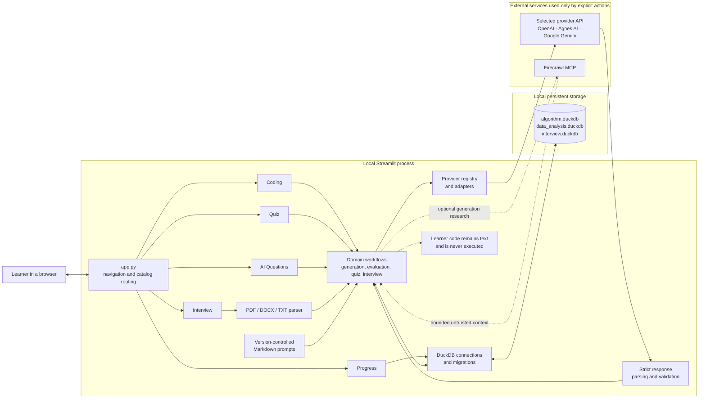
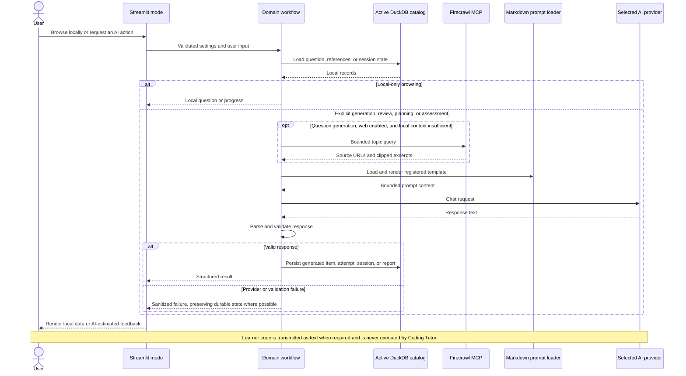
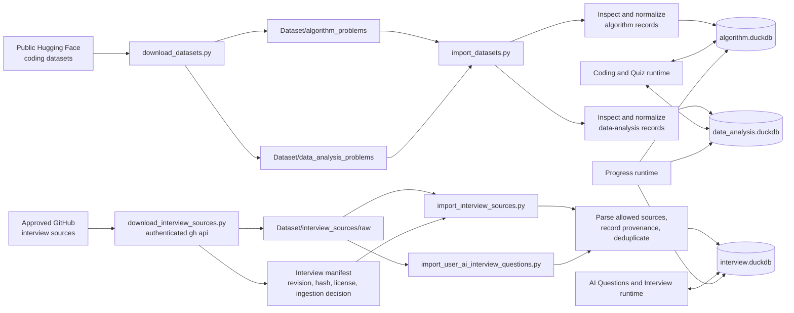

# Architecture

## Runtime system architecture

The UI, domain logic, provider adapters, and database connections run in one local Python process. There is no separate API server, worker, message queue, authentication service, or learner-code execution service.

## Explicit AI action lifecycle

Typing and local catalog browsing do not contact an external service. Firecrawl is generation context only and never participates in scoring.

## Dataset and catalog data flow

Download and import commands are offline preparation steps. Normal application use reads and writes the three consolidated catalogs rather than querying raw dataset directories.

## Local embedded storage

DuckDB keeps questions, provenance, fixture/expected-result assets, attempts, and quiz state in one file without a database server. Transactional migrations and imports suit a single-user local app. DuckDB is storage for data-analysis exercise context, not an engine for learner SQL: the application does not execute submissions. The trade-off is that the user must protect and back up the file; the app is not designed for concurrent multi-user or public deployment.

## Semantic classification

Import catalog metadata—not the folder name—sets `algorithm` or `data_analysis`. This avoids turning directory layout into product semantics and lets validation expose curated algorithms in Python, JavaScript/TypeScript, Java, and C++ while preserving the shared analytical-asset contract.

## One analytical problem, four expressions

A complete data-analysis task has one schema, deterministic fixture, and expected rows. SQL, Pandas, PySpark, and Polars are alternative authoring forms for that same task. The shared contract makes model feedback comparable, but the app does not execute any form or prove equivalence. Imported SQL sources without fixture/expected rows remain incomplete.

## Curated and generated questions

Curated questions are repeatable and preserve source context. Generated questions add topic/difficulty variety and can provide the complete cross-method data contract. Strict validation rejects malformed output; it cannot prove semantic correctness.

## Provenance and licensing

Dataset name, stable identity, file/revision/index, license, attribution, and import time support deduplication and traceability. Metadata is not legal clearance: users must review current upstream terms, especially mixed-origin or unlicensed cards.

## Why code is not executed

Executing arbitrary learner code safely would require a real isolation boundary with no secrets, database, source-tree, network, or unrestricted filesystem access plus resource limits and cleanup. Those guarantees are difficult to provide reliably on local Windows. The current design avoids that boundary entirely and sends text for static AI review. Its trade-off is fundamental: marks are estimates, not test results.

If execution is ever added, it must be isolated outside Streamlit and separately threat-modeled. The current code contains no runner or sandbox.

## Windows and PySpark trade-offs

Windows 11 is the tested launcher platform. JavaScript/TypeScript, Java, C++, and PySpark appear only as editor and AI-review methods. The project does not install language runtimes, compilers, PySpark, or Spark. Polars is likewise not installed. Users may run code externally in an environment they control, but that is outside Coding Tutor's safety model.
