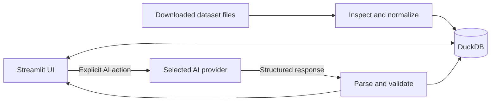

# Technical Reference

This document describes the implemented architecture and runtime contracts of Coding Tutor. It is intended for contributors and maintainers. For task-oriented instructions, see [Usage](USAGE.md).

## Purpose and scope

Coding Tutor is a single-user Streamlit application for local algorithm and data-analysis practice. It combines curated dataset questions with validated AI-generated questions, sends learner text to a selected AI provider for static review, and stores questions and progress in DuckDB.

The application does not execute learner Python, SQL, Pandas, PySpark, or Polars code. Stored tests, fixtures, and expected results provide context to the model; they are not run as verification.

## Architecture overview



Streamlit owns navigation, controls, editor state, and rendering. Domain modules construct bounded provider requests, validate structured responses, and persist accepted results. DuckDB is the only application database. Dataset imports and AI-backed actions are synchronous.

## Component flow

1. `app.py` initializes session state, renders the shared sidebar, and routes to Practice, Quiz, or Progress.
2. The sidebar stores the provider, model, question source, type, difficulty, topic, and method in `st.session_state`.
3. Practice loads a complete normalized question from DuckDB or requests and validates an AI-generated question.
4. The editor stores a draft under a question-and-method-specific session key.
5. **Done** creates a new immutable attempt before requesting static AI feedback.
6. Valid feedback updates that attempt with an estimated percentage, a derived mark out of 10, explanations, and optional corrected code.
7. Stored references or explicitly generated teaching solutions can be displayed. Solution views are recorded locally.
8. Progress queries aggregate Practice attempts, solution views, and separately persisted quiz history.

## Project structure

| Path | Responsibility |
| --- | --- |
| `app.py` | Streamlit entry point and Practice/Quiz/Progress navigation. |
| `.streamlit/config.toml` | Loopback address, port 8551, and headless server configuration. |
| `launch_app.cmd` | Windows launcher that checks for `uv`, creates `.venv`, synchronizes locked dependencies, and starts Streamlit. |
| `scripts/download_datasets.py` | Lists or downloads configured Hugging Face dataset snapshots. |
| `scripts/import_datasets.py` | Inspects and imports selected dataset sources. |
| `src/coding_tutor/ui/` | Sidebar controls, Practice rendering, submission, assessment, solutions, Quiz, and Progress pages. |
| `src/coding_tutor/providers/` | Common provider contract, configuration, registry, and three provider adapters. |
| `src/coding_tutor/generation/` | Prompt construction, strict generated-question validation, and atomic persistence. |
| `src/coding_tutor/evaluation/` | Static assessment, teaching-solution validation, attempt persistence, and solution-view persistence. |
| `src/coding_tutor/database/` | DuckDB connection, transactional migrations, schema, and progress queries. |
| `src/coding_tutor/dataset/` | Dataset catalog, file inspection, source adapters, normalization, and provenance. |
| `src/coding_tutor/quiz/` | Quiz session defaults, rules, durable drafts, preparation, scoring, and persistence. |
| `src/coding_tutor/prompts/` | Registered Markdown prompt templates loaded at runtime. |
| `tests/` | Unit, temporary-DuckDB, mocked-provider, and Streamlit AppTest coverage. |

## Streamlit UI and state

The navigation options are **Practice**, **Quiz**, and **Progress**. The shared sidebar exposes:

- provider and verified model;
- Curated dataset, AI generated, or Mixed question source;
- `algorithm` or `data_analysis` question type;
- Beginner, Easy, Medium, Hard, or Very Hard difficulty;
- topic/tag; and
- a method valid for the selected question type.

Algorithms use `python`. Data-analysis questions expose `sql`, `pandas`, `pyspark`, and `polars`.

Editor keys contain the question ID and method. A separate baseline key determines whether the draft is dirty. Changing question type or method with unsaved content opens a non-dismissible **Keep draft and switch**, **Discard draft and switch**, or **Cancel** dialog. Ordinary Practice drafts exist only in the active Streamlit session. Quiz drafts are persisted in DuckDB.

## Providers and models

`BaseProvider` defines `is_configured()`, `get_model_options()`, and `chat()`. `ModelOption` associates a model ID with a provider, verification flag, documentation URL, and request parameters. Only registry entries marked verified are selectable.

| Provider | Model ID | Implemented request |
| --- | --- | --- |
| OpenAI | `gpt-5.6-luna` | OpenAI Chat Completions with `reasoning_effort="medium"`. |
| Agnes AI | `agnes-2.5-flash` | OpenAI-compatible Chat Completions using the fixed Agnes API base URL. |
| Google Gemini | `gemini-3.5-flash-lite` | Google Gen AI Interactions with medium thinking and provider-side storage disabled. |
| Google Gemini | `gemini-3.7-flash` | Google Gen AI Interactions with medium thinking and provider-side storage disabled. |

Request construction is covered by mocked tests. The repository does not test live authentication, model entitlement, quota, or current service availability. A sidebar “configuration available” status means only that the required environment variable contains a non-blank value.

## Environment variables

| Name | Behavior |
| --- | --- |
| `OPENAI_API_KEY` | Configures the OpenAI adapter when non-blank. |
| `OPENAI_BASE_URL` | Optional OpenAI SDK base URL; blank becomes `None`. |
| `AGNES_API_KEY` | Configures the Agnes adapter when non-blank. |
| `GOOGLE_API_KEY` | Configures Gemini when non-blank. `GEMINI_API_KEY` is not used. |
| `CODING_TUTOR_DB` | Overrides the database path; the default is `coding_tutor.duckdb`. |
| `HF_TOKEN` | Optional credential used by the dataset downloader. |
| `HUGGING_FACE_HUB_TOKEN` | Fallback credential name used by the downloader. |

`.env.example` contains blank provider-variable names for reference. The application does not load it and has no dotenv dependency.

## DuckDB storage

`get_db()` creates a process-level singleton connection, creates a missing parent directory, and applies migrations. Tests use migrated in-memory or temporary databases. Schema version 5 contains these tables:

| Table | Purpose |
| --- | --- |
| `schema_versions` | Records applied transactional migrations. |
| `import_runs` | Records each dataset import status and imported/skipped counts. |
| `question_sources` | Stores dataset identity, record identity, file/revision/index, license, and attribution. |
| `questions` | Stores normalized question fields, methods, tags, completeness, and AI-origin flag. |
| `question_assets` | Stores schemas, fixture data, expected results, and starter code. |
| `reference_solutions` | Stores method-specific dataset or generated solution artifacts. |
| `question_test_cases` | Stores input and expected-output context. |
| `ai_generated_questions` | Stores provider, model, prompt version, and non-secret generation metadata. |
| `attempts` | Stores immutable Practice submissions and assessment state. |
| `solution_views` | Stores viewed solution methods and an optional attempt association. |
| `quiz_attempts` | Stores quiz settings, lifecycle, and aggregate results. |
| `quiz_items` | Stores question snapshots, durable answers, MCQ data, scores, and feedback. |

Every Practice submission gets a new UUID; previous attempts are not updated or replaced. Assessment fields on that newly created attempt transition from pending to completed or error. Quiz records remain separate from Practice attempts while retaining question provenance.

The project does not encrypt the database, manage filesystem permissions, create backups, or provide an in-app deletion/reset workflow.

## Dataset import and normalization

The default source root has this shape:

```text
Dataset/
├── algorithm_problems/
└── data_analysis_problems/
```

The catalog defines source keys, paths, formats, required fields, and semantic question types. Import discovery checks actual JSON, JSONL, or Parquet content before handing records to a source adapter. Folder names do not determine the stored question type.

Normalization stores a question, source provenance, assets, references, and test cases in one transaction. A stable source key and a unique dataset/source-key index make repeated imports idempotent. Raw source files are read without being renamed or overwritten.

Complete data-analysis questions require a schema, non-empty fixture rows, and a deterministic expected result shared by all four methods. SQL-family sources that lack fixture rows and expected results remain incomplete and do not appear in the curated picker. Dataset-specific formats, licenses, and limitations are documented in [Datasets](DATASETS.md).

Verified commands:

```powershell
uv run python scripts/download_datasets.py --list
uv run python scripts/download_datasets.py
uv run python scripts/import_datasets.py
uv run python scripts/import_datasets.py --datasets leetcode apps taco
```

## Question model

Normalized questions include an ID, title, `question_type`, difficulty, tags, problem statement, constraints/examples where present, supported methods, completeness, origin, and timestamps. Related tables hold source metadata, starter assets, fixtures, expected results, references, and test cases.

| Question type | Supported methods | Completeness rule |
| --- | --- | --- |
| `algorithm` | `python` | A usable Python coding task with the normalized question context required by its adapter or generator. |
| `data_analysis` | `sql`, `pandas`, `pyspark`, `polars` | Shared schema, fixture data, and expected result must all exist. |

AI-generated algorithm questions additionally require examples, constraints, starter code, and test cases. Generated data-analysis responses must contain exactly all four methods, consistent rows, starters, and references. Missing or unexpected fields cause rejection before persistence.

## Submission and assessment lifecycle

1. **Done** is available only for non-blank editor text.
2. The handler saves the exact submission, selected method, provider/model identifiers, `deterministic_test_result="not_run"`, and pending assessment state.
3. It validates that the provider is configured and the selected model belongs to that provider's verified registry options.
4. It sends bounded question context, method, learner text, applicable assets, test cases, and at most one method-specific reference to the provider.
5. Strict parsing accepts only the expected structured assessment fields.
6. The application derives marks as `estimated_percentage_correct / 10` and stores the assessment or a sanitized failure state.

The original submission is immutable. If corrected code is returned, **Apply correction to editor** first saves the current editor value under an attempt-specific session key. **Restore pre-correction code** reverses the replacement; restoring after later edits warns that those edits will be replaced.

## Solution display

**Show Solution** opens stored references and labels them as dataset-provided or stored AI-generated. Displaying an existing reference requires no provider call. An explicit generation button can request up to three Python teaching approaches for an algorithm question or one solution for the selected data-analysis method. Responses must contain the required commented code, explanation, and theory fields.

Generated teaching solutions are cached in Streamlit session state, not stored as a general solution record. Displayed methods are written to `solution_views`. Neither generated solutions nor cross-method equivalence are executed or verified.

## Static review versus execution

There is no code runner, SQL execution engine for submissions, container, sandbox, timeout, resource limit, network block, or filesystem isolation. Learner text is never imported or evaluated by the application. The safety boundary against malicious learner code is non-execution, not sandboxing.

Consequently, correctness percentages, marks, solved status, and coding-quiz scores are AI estimates. Static review can miss runtime errors, dependency issues, data-type behavior, ordering differences, performance problems, and hidden edge cases.

## Prompt architecture

Runtime templates are Markdown files under `src/coding_tutor/prompts/`. A restricted loader accepts registered filenames, and rendering rejects missing, extra, or non-text placeholder values.

| Template | Runtime use |
| --- | --- |
| `shared_rules.md` | Shared static-reasoning, untrusted-input, secret-handling, and JSON rules. |
| `algorithm_question_generator.md` | Algorithm question generation. |
| `data_analysis_question_generator.md` | Data-analysis question generation. |
| `static_code_reviewer.md` | Learner submission assessment. |
| `solution_teacher.md` | Teaching solutions and explanations. |
| `quiz_generator.md` | Batched MCQ preparation. |
| `dataset_record_converter.md` | Registered and tested for rendering, but not called by the deterministic importer. |

Question generation stores prompt version `v3`. Teaching-solution cache keys use `solution-v2`. Practice attempts and quiz records do not store one uniform prompt-version field, so not every historical AI result can be mapped to an exact prompt revision from database data alone.

## Quiz and progress behavior

Quiz Mode supports 1–10 items, with a user-selected coding count and remaining MCQs. It is untimed, equally weighted, has no negative marking, and passes at 80%. MCQs receive 100 or 0 from a local option-ID comparison. Blank coding answers receive 0; non-blank coding answers use static AI assessment. Feedback is hidden until scoring completes, and preparation/scoring failures preserve durable state for retry.

Progress filters Practice and Quiz records by question type, difficulty, and method. A Practice question is “AI-estimated solved” when any completed matching attempt reaches 80%. Attempts remain separate and marks are not averaged.

## Failure handling and limitations

- Missing credentials prevent provider calls and produce a configuration-unavailable message.
- Unknown, unverified, or provider-mismatched models are rejected before a request.
- Provider exceptions are converted to user-safe messages; raw exception details are not rendered.
- Malformed JSON and exact-schema violations are rejected.
- Generated-question persistence is transactional, preventing partial accepted questions.
- Quiz preparation and scoring use durable error states with retry controls.
- Provider availability is not checked until an explicit request, and no automatic provider/model fallback exists.
- AI output can be semantically wrong even when it passes structural validation.
- PySpark, Java, Spark, and Polars are not application execution dependencies. Pandas is an application dependency, but learner Pandas text is not run.

See [AI Behavior](AI_BEHAVIOR.md) for request-content limits and [Security and Privacy](SECURITY_AND_PRIVACY.md) for storage and external-provider boundaries.

## Tests and developer commands

Install from the lock file and run the suite:

```powershell
uv sync --locked
uv run pytest -q
```

The suite covers configuration, provider request construction with mocks, prompt rendering, database migrations, importer adapters and idempotency, generation validation and atomic storage, static assessment persistence, reversible corrections, solution rendering/persistence, repeated attempts, progress calculations, quiz behavior, and Streamlit controls.

Tests use mocked provider calls and small fixture files. They do not contact live providers, execute learner code, verify a local Spark runtime, or import complete downloaded corpora.
