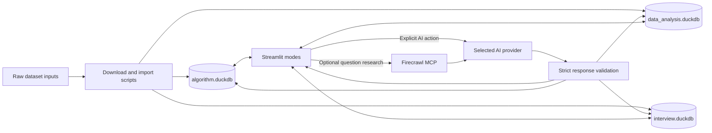

# Technical Reference

This reference describes Coding Tutor as implemented in the current source tree. It is intended for contributors and maintainers. For task-oriented instructions, see [Usage](USAGE.md); for design rationale, see [Architecture](ARCHITECTURE.md).

## Runtime boundaries

Coding Tutor is a single-user Streamlit application with five modes: **Coding**, **Quiz**, **AI Questions**, **Interview**, and **Progress**. It reads consolidated local DuckDB catalogs and makes external requests only for explicit AI or web-research actions.

Learner Python, JavaScript/TypeScript, Java, C++, SQL, Pandas, PySpark, and Polars text is never executed. Stored tests, fixtures, and expected results are provider context, not deterministic verification. Every displayed score or correctness percentage for free-text or code answers is an AI estimate.

## Architecture



All provider and dataset operations are synchronous. Streamlit session state holds transient controls and editor drafts. Durable questions, attempts, quiz state, AI-question sessions, interview sessions, and reports are stored in the catalog that owns the activity.

## Entry points

| Entry point | Command | Purpose |
| --- | --- | --- |
| `app.py` | `uv run --locked streamlit run app.py` | Launch the unified application on `127.0.0.1:8551`. |
| `launch_app.cmd` | Double-click or run from `cmd.exe` | Verify `uv`, create `.venv`, synchronize locked dependencies, and launch the app. |
| `scripts/run_catalog.py` | `uv run python scripts/run_catalog.py algorithm` | Launch a fixed algorithm or data-analysis catalog profile. |
| `scripts/download_datasets.py` | `uv run python scripts/download_datasets.py` | Download configured coding datasets from Hugging Face. |
| `scripts/import_datasets.py` | `uv run python scripts/import_datasets.py` | Normalize coding datasets into DuckDB. |
| `scripts/download_interview_sources.py` | `uv run python scripts/download_interview_sources.py` | Download licensed interview source files through authenticated GitHub CLI. |
| `scripts/import_interview_sources.py` | `uv run python scripts/import_interview_sources.py` | Normalize allowed interview sources into `interview.duckdb`. |
| `scripts/import_user_ai_interview_questions.py` | `uv run python scripts/import_user_ai_interview_questions.py` | Import the project-maintained AI interview question collection. |

## Package map

| Path | Responsibility |
| --- | --- |
| `src/coding_tutor/catalog.py` | Catalog profiles and activity-to-database routing. |
| `src/coding_tutor/database/` | Connections, schema, migrations, and coding progress queries. |
| `src/coding_tutor/dataset/` | Source catalogs, inspection, parsing, normalization, and provenance. |
| `src/coding_tutor/evaluation/` | Static assessment, teaching solutions, and attempt persistence. |
| `src/coding_tutor/generation/` | Coding-question generation, validation, and persistence. |
| `src/coding_tutor/interview/` | AI-question and interview planning, generation, assessment, and persistence. |
| `src/coding_tutor/providers/` | Provider contract, registry, configuration, and adapters. |
| `src/coding_tutor/quiz/` | Quiz lifecycle, durable drafts, preparation, scoring, and persistence. |
| `src/coding_tutor/ui/` | Streamlit pages, controls, rendering, and submit handlers. |
| `src/coding_tutor/web_research.py` | Bounded Firecrawl MCP research for question generation. |
| `src/coding_tutor/prompts/` | Registered Markdown prompt templates. |

## Navigation and state

`app.py` sets page configuration, initializes shared state, renders the provider sidebar, and routes to the selected mode.

| Mode | Main UI module | Durable storage |
| --- | --- | --- |
| Coding | `ui/main_page.py` | `attempts`, generated questions, and solution views in a coding catalog |
| Quiz | `ui/quiz_page.py` | `quiz_attempts` and `quiz_items` in a coding catalog |
| AI Questions | `ui/ai_questions_page.py` | `interview_items`, `ai_question_sessions`, and `ai_question_items` |
| Interview | `ui/interview_page.py` | `interview_sessions` and `interview_turns` |
| Progress | `ui/progress_page.py` | Reads all applicable catalogs |

Coding editor keys include the question ID and method. A baseline key tracks whether a draft is dirty. Switching question type or method with unsaved content requires an explicit keep, discard, or cancel decision. Ordinary Coding drafts are transient; Quiz drafts are durable.

## Catalog routing

| Catalog | Owned activity |
| --- | --- |
| `Dataset/catalogs/algorithm.duckdb` | Algorithm questions, Coding attempts, algorithm quizzes, and solution views |
| `Dataset/catalogs/data_analysis.duckdb` | Data-analysis questions, Coding attempts, data-analysis quizzes, and solution views |
| `Dataset/catalogs/interview.duckdb` | AI Questions, interview question bank, timed interviews, and reports |

`database_for_question_type()` maps algorithms to the algorithm catalog and data analysis to the data-analysis catalog. `interview_database()` returns the interview catalog. `get_db()` caches a migrated connection per resolved path rather than using one global connection.

`CODING_TUTOR_DB` is an advanced/test override. When present, it can direct activity to one path; it is not the normal unified-app storage model.

## Environment variables

| Name | Behavior |
| --- | --- |
| `OPENAI_API_KEY` | Configures OpenAI when non-blank. |
| `OPENAI_BASE_URL` | Optional OpenAI-compatible endpoint. Blank is treated as unset. |
| `AGNES_API_KEY` | Configures Agnes AI when non-blank. |
| `GOOGLE_API_KEY` | Configures Google Gemini when non-blank. |
| `FIRECRAWL_API_KEY` | Optional bearer credential for Firecrawl MCP; absence selects keyless access. |
| `CODING_TUTOR_DB` | Advanced override for the resolved DuckDB path. |
| `CODING_TUTOR_CATALOG` | Selects a fixed catalog profile when using catalog-specific launching. |
| `HF_TOKEN` | Optional Hugging Face downloader credential. |
| `HUGGING_FACE_HUB_TOKEN` | Fallback Hugging Face credential name. |

`.env.example` is a names-only reference. The application does not load dotenv files. A provider shown as configured only has a non-blank expected variable; authentication, entitlement, quota, and connectivity are checked by the provider during a request.

## Provider contract

`BaseProvider` exposes `is_configured()`, `get_model_options()`, and `chat()`. `ModelOption` binds a provider to an allowed model ID and request settings. The registry rejects unknown, unverified, or provider-mismatched selections before sending a request.

Provider calls return text that domain services parse into exact schemas. Unexpected keys, missing fields, invalid types, out-of-range scores, or malformed JSON cause rejection. Provider exceptions are converted into bounded user-safe errors; raw exception details and credential values are not rendered.

## Coding mode

Coding supports:

- Algorithm questions with Python.
- Data-analysis questions with SQL, Pandas, PySpark, or Polars authoring.
- Curated questions, AI-generated questions, or Mixed selection where the profile permits it.
- Optional topic filtering or generation guidance.
- Static AI review, reversible editor correction, stored references, and requested teaching solutions.

Selecting **Submit solution** first stores the exact original text as a new immutable attempt. The application then validates provider/model configuration and requests static review. Successful responses store the estimated percentage, marks calculated as `percentage / 10`, mistakes, explanation, suggested correction, and optional corrected code. Failures leave the attempt with a sanitized error state.

Applying corrected code affects only the active editor. The submitted attempt remains unchanged and can be restored to the editor from an attempt-specific backup.

## Quiz mode

Quiz supports 1–10 items. The learner chooses the coding-item count; remaining items are MCQs. Items are equally weighted, there is no negative marking, and the pass threshold is 80%.

MCQ options are prepared through the selected provider and scored locally by option ID. Blank coding answers receive zero; non-blank coding answers use static AI review. Answers are saved as durable drafts. Preparation or scoring failures retain state and expose retry actions. A retry must use the provider and model stored with the quiz.

## AI Questions mode

AI Questions provides one question at a time from `interview.duckdb`.

| Setting | Values or behavior |
| --- | --- |
| Source | Local catalog, AI generated, or Mixed |
| Domain/topic | Catalog facets or user-selected generation context |
| Difficulty | Beginner, Easy, Medium, Hard, or Very Hard |
| Answer format | Theory, coding, or MCQ |
| Prompt style | Direct or scenario-based |
| Coding language | Python, JavaScript/TypeScript, Java, C++, or SQL |
| Web research | Off by default; applies to generated questions |

Mixed sessions alternate toward local questions on odd positions and generation on even positions. If the selected local question is unavailable, AI-generated modes create, validate, and persist a reusable `interview_items` row before presenting it.

MCQs are scored locally. Theory and coding answers are sent to the selected provider for immediate structured feedback. Code is treated as text and never executed.

## Interview mode

Interview supports **Tech interview** and **JD-based interview**. JD-based planning requires a job description and accepts an optional resume. Input can be pasted or uploaded as PDF, DOCX, or TXT, with a 5 MB limit. The parser does not perform OCR and rejects unreadable, encrypted, damaged, or image-only documents.

Uploaded bytes and extracted text remain in memory. Extracted JD/resume text is sent to the selected provider only to create an editable interview blueprint. The application does not store that raw content in DuckDB. Generated reusable questions must be standalone and omit identifying details.

The learner chooses 30, 45, 60, or 90 minutes. `start_interview()` stores an absolute UTC deadline in DuckDB, so Streamlit reruns cannot reset the timer. Questions rotate through blueprint topics, formats, and languages. Local mode relaxes topic matching before reporting that no suitable local question exists. Generated and Mixed modes can create validated questions as needed.

Only one turn can be pending. Submitted MCQs are scored locally; theory and coding answers use provider assessment. Per-turn feedback is stored but hidden during the interview. The learner can finish early, skip the current turn, or submit the current answer at timeout. No new question is created after the deadline. Completion generates a final report from scored turns; a session with no scored answers receives a zero-score local report.

## Firecrawl MCP

`web_research.py` connects to `https://mcp.firecrawl.dev/v2/mcp` with streamable HTTP. If `FIRECRAWL_API_KEY` exists, it is sent as a bearer token. Otherwise the client attempts keyless access.

The implementation calls `firecrawl_search` with at most five results. It selectively calls `firecrawl_scrape` for at most three short-result pages and bounds every stored excerpt to 6,000 characters. Results are treated as untrusted provider context and stored as source provenance for generated interview items.

Web research is used only when explicitly enabled and local references are insufficient. It never participates in scoring and never receives raw JD/resume text, learner answers, provider credentials, or database contents. A Firecrawl failure produces a warning and generation continues without web material.

## DuckDB schema

Migrations run transactionally for each opened catalog. The current schema includes:

| Table | Purpose |
| --- | --- |
| `schema_versions` | Applied migration versions |
| `import_runs` | Dataset import lifecycle and counts |
| `question_sources` | Source identity, revision, license, and attribution |
| `questions` | Normalized algorithm and data-analysis questions |
| `question_assets` | Schemas, fixtures, expected results, and starter code |
| `reference_solutions` | Dataset or generated method-specific solutions |
| `question_test_cases` | Input/expected-output context |
| `ai_generated_questions` | Coding-generation provider, model, and prompt metadata |
| `attempts` | Immutable Coding submissions and assessment state |
| `solution_views` | Viewed solution methods and optional attempt association |
| `quiz_attempts`, `quiz_items` | Quiz lifecycle, drafts, MCQs, scores, and feedback |
| `interview_items` | Curated and generated AI/interview questions |
| `interview_item_generation` | Provider, model, prompt, and web-source provenance |
| `ai_question_sessions`, `ai_question_items` | AI Questions settings, presented items, answers, and feedback |
| `interview_sessions`, `interview_turns` | Timed plans, deadlines, prompts, answers, scores, and reports |

The application does not encrypt, back up, rotate, or securely delete DuckDB files and does not manage operating-system permissions.

## Dataset import contracts

Raw inputs live under `Dataset/algorithm_problems`, `Dataset/data_analysis_problems`, and `Dataset/interview_sources`. Normal runtime queries use only the consolidated catalogs.

Coding importers inspect the actual JSON, JSONL, or Parquet format before parsing. Normalization stores question content, provenance, assets, solutions, and tests transactionally. Stable source keys make repeated imports idempotent. Complete data-analysis questions require schema, fixture rows, and a deterministic expected result; incomplete records remain reference context and are excluded from curated exercise selection.

Interview downloads use authenticated `gh api`, pin the source revision, record hashes and license metadata, and import only sources marked `ingestion_allowed`. `RecruitView` remains deferred because its non-commercial/access constraints require a separate decision.

## Progress calculations

Progress offers Overview, Algorithms, Data analysis, AI Questions, and Interviews.

- Coding attempts remain separate and are never averaged.
- A Coding question is AI-estimated solved when any completed matching attempt reaches 80%.
- Quiz summaries are separate from Coding attempt summaries.
- AI Questions reports session count, attempted questions, and average scored percentage.
- Interview reports session count, completion count, and average completed score.

## Security and failure behavior

- Typing alone does not contact an external service.
- Explicit generation, assessment, plan creation, report creation, and optional research actions can make external calls.
- Learner code is never imported, evaluated, or executed by the application.
- Invalid generated content is rejected before it becomes usable.
- Database writes that create normalized questions are transactional.
- Missing credentials, unavailable providers, and malformed responses preserve durable activity where possible.
- There is no automatic AI-provider fallback.

See [Security and Privacy](SECURITY_AND_PRIVACY.md) for the data-flow boundaries and [AI Behavior](AI_BEHAVIOR.md) for provider request details.

## Verification

```powershell
uv sync --locked
uv run pytest -q
uv run python scripts/download_datasets.py --list
uv run python scripts/import_datasets.py --help
uv run python scripts/download_interview_sources.py --list
uv run python scripts/import_interview_sources.py --help
uv run python scripts/import_user_ai_interview_questions.py --help
```

Tests use mocked providers and temporary or in-memory DuckDB databases. They do not prove live model access, Firecrawl availability, or successful full-corpus imports.
