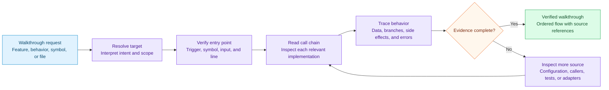

# Code Walkthrough Workflow

This workflow describes how a code walkthrough moves from a requested feature, behavior, symbol, or file to an evidence-backed execution narrative.

The trace records, where applicable:

- who calls each stage and what it calls next;
- inputs, outputs, and data transformations;
- validation, branching, and early returns;
- external calls, state changes, side effects, and exceptions.

Missing links return to source inspection. They are never filled with assumptions.
