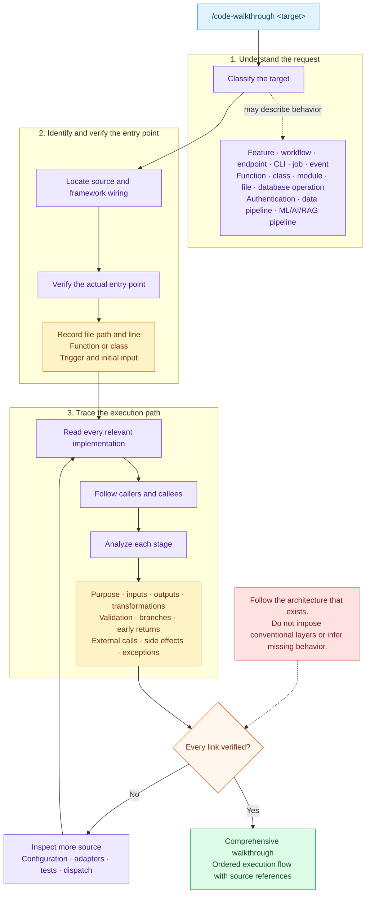

# Code Walkthrough Generator

The generator accepts a feature, behavior, symbol, endpoint, command, pipeline, or file and produces a source-backed explanation of its real execution path.



## Invocation examples

```text
/code-walkthrough authentication flow
/code-walkthrough src/api/payments.ts
/code-walkthrough "what happens when a user submits an order"
/code-walkthrough POST /api/orders
/code-walkthrough processPayment()
```

The walkthrough must be derived from implementation code and verified configuration. Names, comments, documentation, and conventional architecture patterns are not substitutes for reading the actual execution chain.
