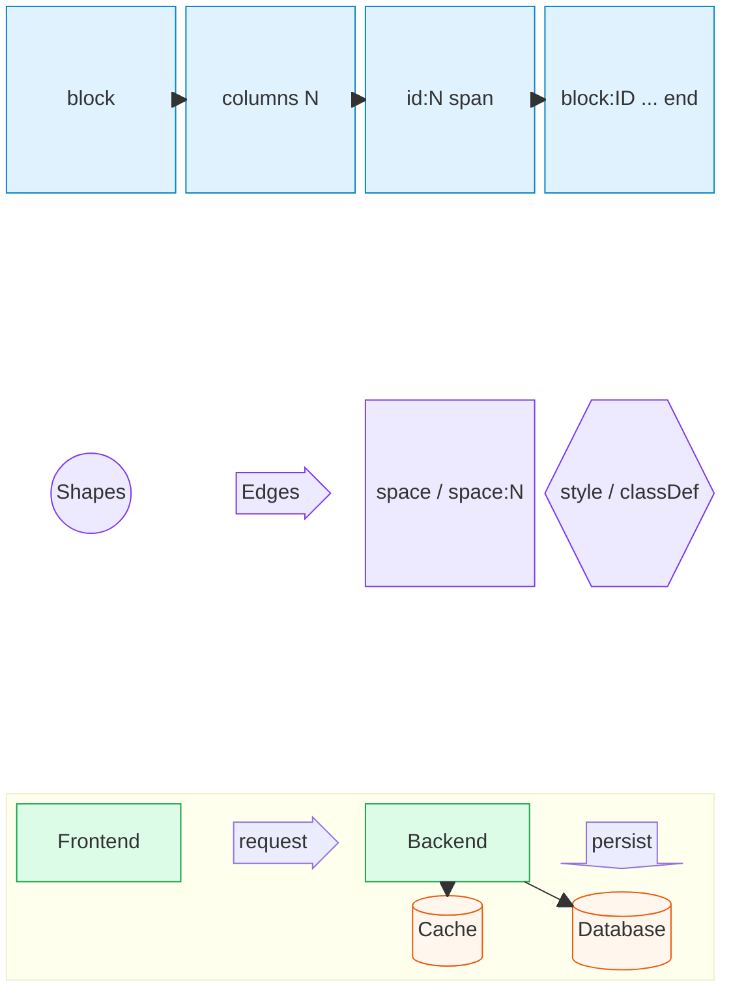

# Mermaid Block Diagram Authoring Map

This Mermaid `block` diagram demonstrates explicit columns, spans, reserved space, semantic shapes, block arrows, nested composition, edges, and reusable styles.

## Authoring guide

- `columns N` establishes the placement grid; declarations fill cells in order.
- `id:N` makes a block occupy `N` columns.
- `block:ID:N ... end` creates a named composite spanning `N` columns.
- `space` reserves one cell; `space:N` reserves several cells.
- Composite blocks can define their own column count independently.
- Block arrows occupy layout cells and communicate direction visually.
- Use normal edges for relationships that should remain explicit beyond placement.
- Prefer classes for repeated styling and `style` for isolated emphasis.

Block diagrams prioritize author-controlled placement. That makes them useful when automatic flowchart layout moves components away from their intended positions.
