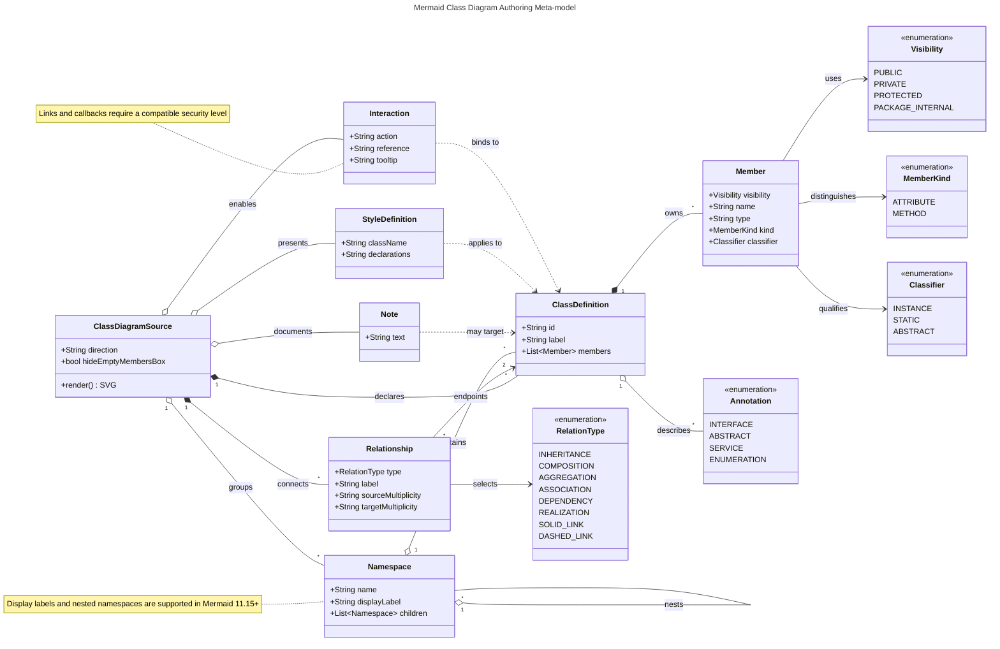

# Mermaid Class Diagram Authoring Map

This meta-model uses a Mermaid `classDiagram` to show the main elements available when authoring Mermaid class diagrams.

## Relationship notation

| Meaning | Mermaid notation |
|---|---|
| Inheritance | `<\|--` |
| Composition | `*--` |
| Aggregation | `o--` |
| Association | `-->` |
| Dependency | `..>` |
| Realization | `..\|>` |
| Solid link | `--` |
| Dashed link | `..` |

Visibility prefixes are `+` public, `-` private, `#` protected, and `~` package/internal. Methods contain parentheses; attributes do not. Static members end with `$`, while abstract methods end with `*`.
