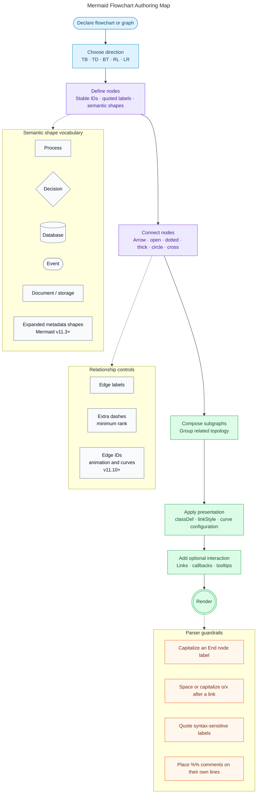

# Mermaid Flowchart Authoring Map

This diagram condenses Mermaid flowchart syntax into an authoring path and a small set of reference groups.

## Selection guide

- Use node shapes to communicate meaning, not decoration.
- Use labeled edges only when the relationship is not already obvious.
- Use subgraphs for real boundaries or conceptual groupings.
- Prefer `classDef` for reusable styling.
- Use ELK for larger diagrams when the hosting Mermaid version supports it.
