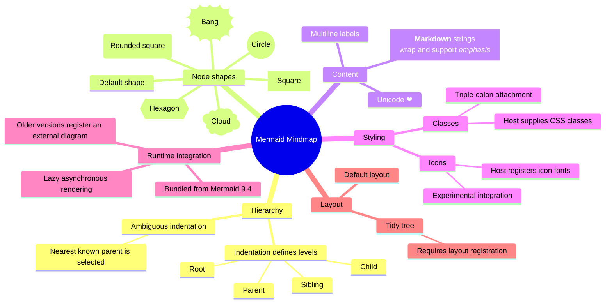

# Mermaid Mindmap Authoring Map

This Mermaid `mindmap` organizes the syntax and integration concerns around one central concept.

## Authoring rules

- Indentation is relative: children are indented further than their parent, while siblings align.
- Use a consistent indentation width even though Mermaid can recover some ambiguous outlines.
- Markdown strings support bold, italics, wrapping, multiline text, and Unicode.
- Icon packs and custom CSS classes are host-level integrations, not self-contained diagram features.
- Mindmaps remain experimental; icon integration is specifically identified as unstable.
