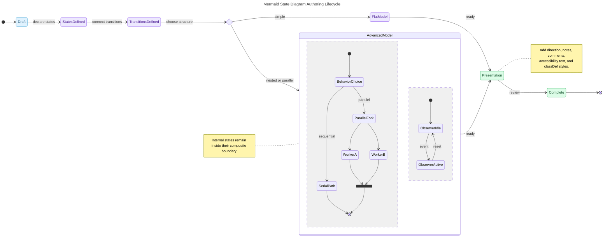

# Mermaid State Diagram Authoring Map

This Mermaid `stateDiagram-v2` demonstrates a finite-state authoring lifecycle and the principal behavior constructs available to state diagrams.

## Construct guide

| Construct | Mermaid syntax | Purpose |
|---|---|---|
| Initial or terminal state | `[*]` | Marks entry or completion according to arrow direction |
| Transition | `A --> B : event` | Connects states with an optional event or guard |
| Composite state | `state Name { ... }` | Encapsulates nested states |
| Choice | `state Name <<choice>>` | Selects among guarded paths |
| Fork and join | `<<fork>>`, `<<join>>` | Splits and reunites parallel paths |
| Concurrent regions | `--` | Separates independent regions inside a composite state |

Internal states belonging to different composite states cannot transition directly. Current `classDef` limitations also prevent styling initial/terminal markers and states inside composite states.
