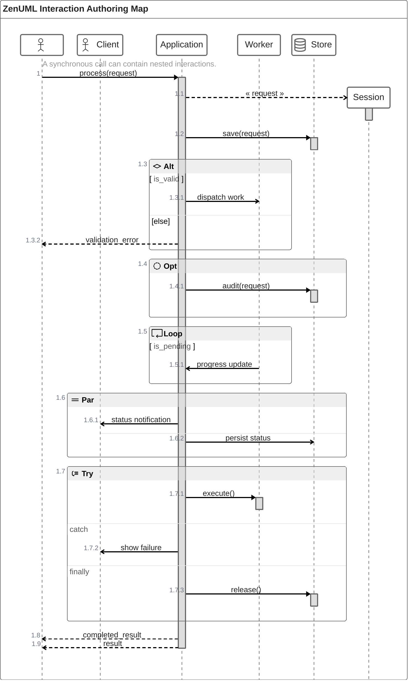

# Mermaid ZenUML Authoring Map

ZenUML is an alternative Mermaid sequence-diagram syntax. It models interactions with programming-language-like calls, braces, assignments, returns, and control structures.



## Participant declarations

| Form | Meaning |
|---|---|
| `Alice` | Explicitly declares a participant and fixes its order. Participants may otherwise be inferred from messages. |
| `A as Alice` | Uses `A` as the source identifier and `Alice` as the displayed label. |
| `@Actor Alice` | Declares a participant with an annotator symbol. |
| `@Database Store` | Declares a database-styled participant. |

Participants render in declaration order, or in first-appearance order when they are implicit.

## Message forms

| Message | Representative syntax | Behavior |
|---|---|---|
| Synchronous | `Service.method(args)` | Represents a blocking call. Add `{ ... }` to nest interactions. |
| Asynchronous | `Alice->Bob: event` | Represents a non-blocking message or fire-and-forget event. |
| Creation | `new Session(args)` | Creates a participant or object. Creation messages can also be nested. |
| Reply by assignment | `result = Service.method()` | Captures the result of a synchronous call. A type may precede the variable. |
| Reply by return | `return result` | Returns from the current synchronous nesting level. |
| Annotated reply | `@return` or `@reply` before an async-form message | Explicitly returns one level upward; useful for exceptional early replies. |

## Control and structure

- Loop blocks: `while`, `for`, `forEach`, `foreach`, or `loop` followed by a braced body.
- Alternatives: `if`, optional `else if`, and optional `else` blocks.
- Optional behavior: `opt { ... }`.
- Parallel behavior: `par { ... }`.
- Exception and cleanup behavior: `try`, `catch`, and `finally` blocks.
- Comments: `// comment`. Comments immediately above messages or fragments are rendered and may contain Markdown; comments elsewhere are ignored.

## Browser integration

ZenUML uses Mermaid's external-diagram registration mechanism and experimental lazy, asynchronous loading:

```html
<script type="module">
  import mermaid from "https://cdn.jsdelivr.net/npm/mermaid@10/dist/mermaid.esm.min.mjs";
  import zenuml from "https://cdn.jsdelivr.net/npm/@mermaid-js/mermaid-zenuml@0.1.0/dist/mermaid-zenuml.esm.min.mjs";

  await mermaid.registerExternalDiagrams([zenuml]);
</script>
```

ZenUML syntax differs from Mermaid's original `sequenceDiagram` grammar; treat the two formats as separate authoring languages.
